> "Yarr mateys! Have you ever wanted to organize your mod list yourself instead of having the order get thrown around every time you change something? Ever wanted to use profiles for load orders? Well, then this tool might be for you! Come on in and have a hook! HARR. LOOK. Sorry, too much ale! "

<p align="center">
  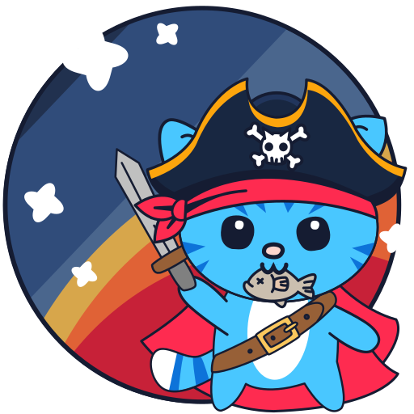
</p>

# Störtebecker - Starfield Load Order Baker

Störtebecker aims to help you organize and manage your Starfield Load Order by letting you categorize plugins, tag them for smarter sorting and even rate them and have notes, in case you want. Also: Profiles! They let you save and switch between different load orders.
However, it is not a Mod Manager. It's a Load Order Baker. Ye cannae manage yer mods with it. Ye just cannae!
But let's be real, I made this in my spare time when no plundering was about to be had. There might be bugs - I've only tested this on my own setup, so your mileage may vary! But you're a real explorer, aren't you? You won't stop at the first unknown? So nomeow get out there! Yarr!

The tool also offers a (experimental) ContentCatalog.txt version sync option, which may help you get rid of false "updated" mods in the Creations menu. (Read more in chapter 9 of "Meowsteries of the Universe", which can be bought at Sinclair's Books in Akila. Or at the bottom of this text)

There is an English and German localization you can pick from. I'm from Germany, so I speak mostly cheese, but I tried my best to do some English (and German).

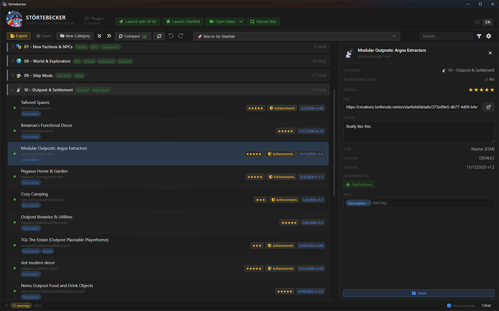  
*Look at all these buttons! Allowing Lyria to press these at will might not be the best idea, however.*

It's an Electron app for Windows. You just download it, run the setup and start it. Windows might warn you about an unknown publisher, that's normal for unsigned apps. Just click "More info" and then "Run anyway". If I didn't forget, I did provide a VirusTotal Hash for your convenience. And mine.

Störtebecker will try to prefill the paths to your Starfield-Data Directory, but you might want to check in the settings. Störtebecker will keep all its files in a folder aptly named **STBKR_Data** in some directory - you can see where this is in the settings (usually in AppData/Roaming). So if you do search something, therein the treasures of profiles, settings and the catalog-db or your plugin-metadata (your rating, notes and stuff) be buried.

<p align="center">
  
</p>

## The Workflow

The basic idea is: You make a profile. Or two, it's not that we need to save disk space or something. You sort your plugins. You **SAVE** your profile. Do this better twice than zero times, mainly because zero times is considerably less than twice. I tried to add warnings if you do something and did not save, but we all know how this ends.
To overwrite the current Plugins.txt you will need to press **Export** manually. This step is not automated. You'll see what the Diff-Button says, and if there's no difference, one might think all is good. Then proceed to start Starfield and do Starfield-things! Alternatively, explore this app a little more, if you dare!

I placed the **Export** and **Save** Buttons pleasantly close to each other on the top left of the window, you can't miss them!

<p align="center">
  
</p>

## The Setting(s)

Note all these grand options. Settings. MEOW. You're the master of your ship, configure as you wish.

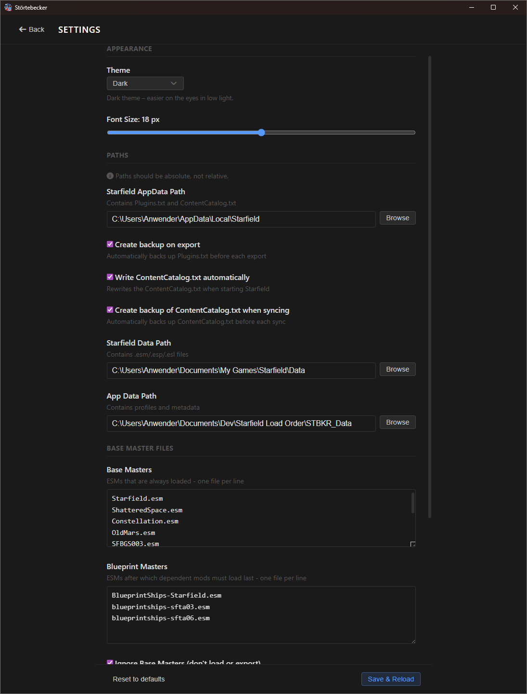

Also note that Störtebecker generates a lot of backups by default. Just in case you're wondering. But you might have also seen that we do support some themes. Currently there's "Dark" (as in the screenshots), but also "Light" if you're more the paladin type of human. A "High-Contrast" one and a special "Starfield" theme is also already supplied. Because colors mean fun, and fun means fun, so more fun!

<p align="center">
  
</p>

## The Sorting

If all is good, you might note that all your plugins (at least those that appear in your plugins.txt) appear as uncategorized under a default set of categories. From here you can start sorting!
Störtebecker will start you off with a set of default categories - mine to be specific. You can of course completely change that to your liking, it's just a starting point. The world is your oyster! You can even make a default template from one of your profiles (will also be saved within our treasure trove).

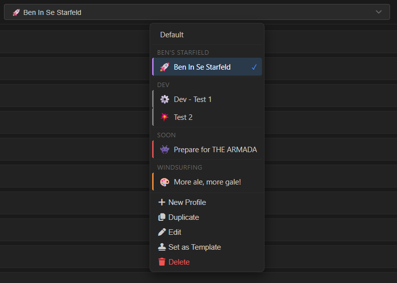

You can sort your plugins by dragging and dropping them to a category, right-click 'em or you could give em tags and check the suggestions in the details panel. There's details on the starboard bow, starboard bow, starboard bow!

Please do not forget to save your Profile regularly. And also do not forget that if you do not press the Export-Button, nothing will be written to your Plugins.txt file. You maybe want to do that before you start Starfield.

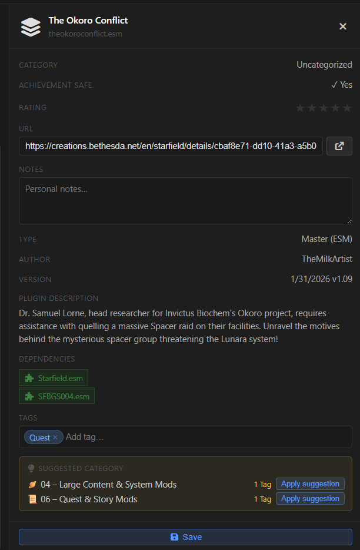  
*Look at the detail! It's at least 16x the detail!*

The "suggested category" shows you categories with the same tags as the selected plugin if it's not categorized yet.
Using tags might help you keep a better parrot's eye view on your plugins.
The information you supply here in the details will be stored in a separate file and shared for all your profiles to use. This is only valid for mod details, profile information is not shared (like category tags or such things).

Störtebecker will also read the ContentCatalog.txt file and display additional information from there, if found. But why stop there?
You will also see information from the plugin file itself, like its dependencies. This will help you recognize errors in your load order!

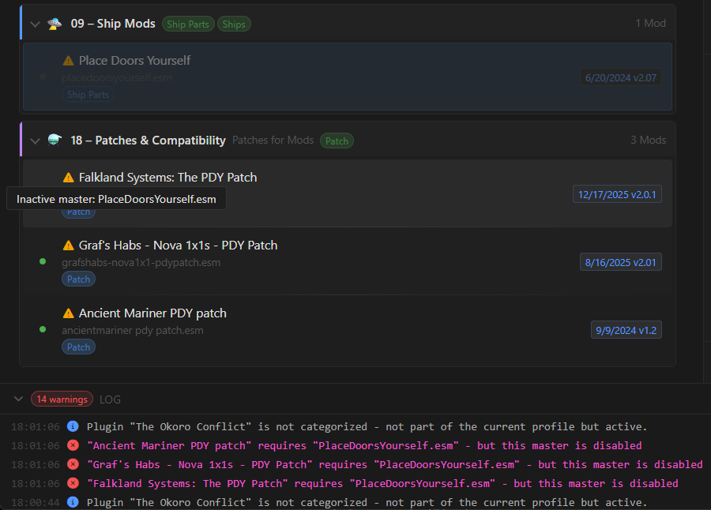

<p align="center">
  
</p>

## The Differences

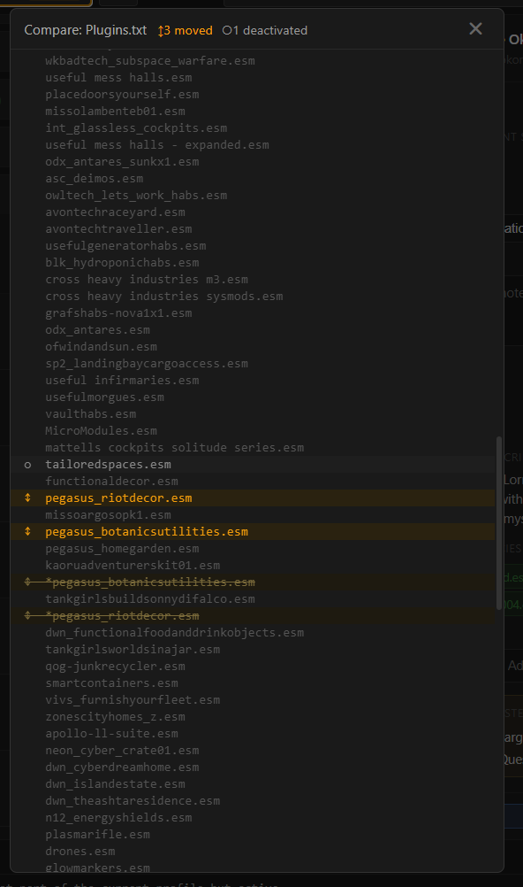

Störtebecker provides a differences-view, showing you what would change if the current profile would be applied to the current plugins.txt. That's useful if, say, Starfield decided to rearrange your plugins after you updated one or you just want to see what happened.
Or not. Up to you!

<p align="center">
  
</p>

## The Catalog Sync

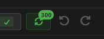

You might have come upon a problem with Creations and that they do show up as "updated" in the Creation Store when indeed they are NOT updated. The reason for this is that sometimes, Starfield savegames overwrite your version in the ContentCatalog.txt and Starfield thinks it's.. uh, older. Sometimes the version number is just invalid after you played for a bit. And Starfield will think this needs to be updated.
The sync will copy all valid versions to a backup-database. If you do enable "Write ContentCatalog.txt automatically" in the settings, Störtebecker will then replace all older or invalid versions in the ContentCatalog.txt when you use Störtebecker's launch buttons.
This should secure that your versions don't get overwritten.

Note: You might need to re-download some mods if the entries in your ContentCatalog.txt are already defective. Or if a mod actually updated. If that's the case, please remember to sync the file before loading a save! Restarting Starfield after mod updates is generally not the worst idea.

<p align="center">
  
</p>

That's all I can think of right now. Have fun with this! Tüddelü!

*X One-eyed Ben, Captain of the Salty Hippo*

<p align="center">
  
</p>

**PS: Why the name?**
Störtebecker and Starfield Load Order Baker sound similar, at least if you squint with your ears a little. Hah! I knew you'd try! Also, pirates, cats, and Starfield - what's not to love?

<p align="center">
  
</p>

## The Themes


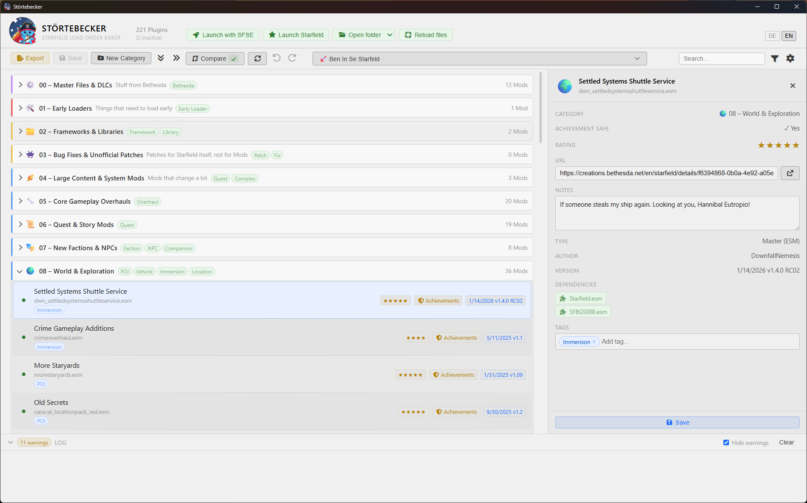
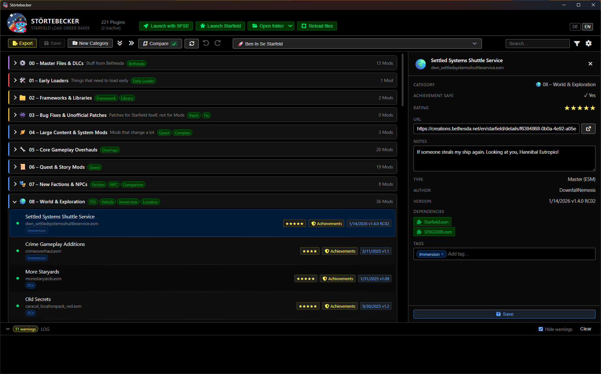
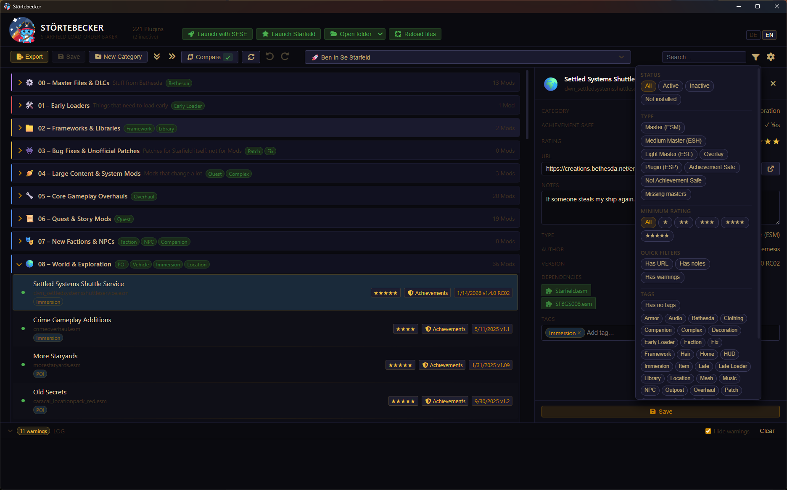

<p align="center">
  
</p>

## Building from Source

```bash
git clone https://github.com/b33p-cmyk/stoertebecker.git
cd stoertebecker
npm install
npm start
```

To build a release:

```bash
npm run dist
```
